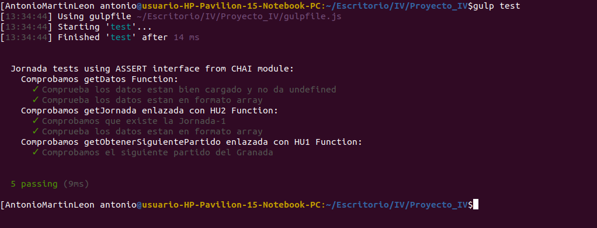

# IV-20-21
# BuscarPartidos

La idea de este microservicio que voy a desarrollar consiste en poder introducir una fecha o una jornada, o el nombre de un equipo y consultar los partidos que hay ese día o esa jornada. Además, para obtener el nombre entrenador de un equipo.

El motivo por el cual he elegido este problema es porque siempre que quiero ver algo similar necesito darle mucho clicks a las plataformas actuales y recorrer varios submenus hasta llegar a la información que busco, en cambio de esta manera va a ser mucho más rápido.

Para implementarlo he elegido NodeJS.

## Documentación del proyecto
Presentamos un listado con la documentación del proyecto en el estado actual:
- Herramientas usadas en el proyecto. [Más información](https://github.com/antonioml97/IV-20-21/blob/master/docs/Herramientas.md)
- Historias de usuario y milestones. [Más información](https://github.com/antonioml97/IV-20-21/blob/master/docs/HistoriasDeUsuario.md)
- Pasos para llevarlo a cabo. [Más información](https://github.com/antonioml97/IV-20-21/blob/master/docs/Pasos.md)

## Test
En las herramientas del proyecto se encuentra la justificación o el motivo que me ha hecho decidir usar estas herramientas para llevar acabo los test. [Más información](https://github.com/antonioml97/IV-20-21/blob/master/docs/Herramientas.md)

Para llevar a acabo los test creados para el proyecto hay que seguir los [siguientes pasos](https://github.com/antonioml97/IV-20-21/blob/master/docs/PasosTest.md).

El fichero donde esta el test se encuentra [aquí](https://github.com/antonioml97/IV-20-21/blob/master/test/testChai.js).

El uso de este test es comprobar que se leen bien los datos y con el formato adecuado, siendo un pequeño avance pero algo significativo para el proyecto, y adicionalmente, ver que existe la jornada 1. Una prueba de su uso es la siguiente imagen:

## Docker
- Elección correcta y justifacion de contenedor base. [Más información](https://github.com/antonioml97/BuscadorPartidos/blob/master/docs/DockerJustificacion.md)
- Fichero para la configuración del docker, llamado **Dockerfile**. [Aquí](https://github.com/antonioml97/BuscadorPartidos/blob/master/Dockerfile).
- Buena práctica para dockerfile. [¿Como lo he hecho?](https://github.com/antonioml97/BuscadorPartidos/blob/master/docs/BuenasPracticasContenedor.md).

## Docker Hub
- Primeros pasos [aquí](https://github.com/antonioml97/BuscadorPartidos/blob/master/docs/DockerHub.md).

## Enlaces adicionales
- [Configuración de git](https://github.com/antonioml97/BuscadorPartidos/blob/master/docs/configGit.md)
- [Información consultada para hacer los test](https://www.paradigmadigital.com/dev/testeando-javascript-mocha-chai/)

## Autor
- Antonio Martín León
