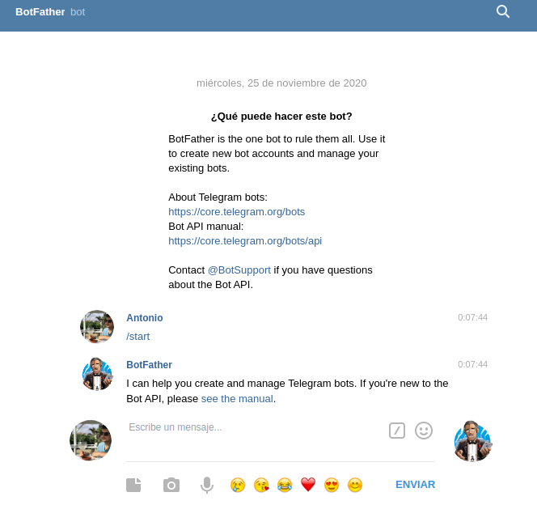

# Despliegue de bot en Telegram con Firebase
Para empezar a trabajar con esta plataforma, es necesario, estas registrado y haber hecho estos comandos:
```
npm install -g firebase-admin
npm install -g firebase-admin
npm install -g firebase-functions
```
Con esto tendremos su SDK, y para logeranos localamente:
```
firebase login
```
Tras esto ya tendriamos todo listo para empezar.
# Vamos con el bot
Lo primero que tenemos que hacer es ejecutar ``` firebase init functions ```, con esto seguimos los pasos indicados y lo linkeamos a el proyecto que hemos creado en firebase, esto nos creara la estrucutra principal.

La carpeta desde donde controlaremos nuestro Bot es [/telegramBot/](https://github.com/antonioml97/BuscadorPartidos/tree/master/telegramBot).
Luego, para poder crear un bot es necesario obtener una Telegram API key, para ello vamos a hablar en telegram con BotFather e indicar que vamos a crear un nuevo bot con la orden **/newbot**.


Para el desarrolo del bot he visto que existe el framework **telegraf** que esta diseñado para NodeJS, la documentacion de este se puede consultar en este [enlance](https://telegraf.js.org/).

## Uso de variables de entorno
Es importante ocultar la Telegram API key, para proteger los datos sensibles y que nadie pueda controlar este bot, para ello vamos a usar las variables de entorno de una forma sencilla.
```
firebase functions:config:set services.telegram_key="<Nuestra clave>" 
```

## Bot


## Integración Continua
He tenido que desarrollar un [workflows](https://github.com/antonioml97/BuscadorPartidos/blob/master/.github/workflows/firebase.yml), para desplegar en firebase cuando nuestro bot sufra un cambio, esto se debe a que en Firebase no tiene integrado Github como ocurre en Netlify

## Donde he seguido los pasos
Para llevas estas tareas acabo he mirado varios tutoriales aunque el que más me ayudo fue [este](youtube.com/watch?v=iqY8yr1_Z_c&list=PLhMX5hA0NWUQoRqYNFBE35NlUn1J915M0&index=1&ab_channel=RomanAkhromieiev)
