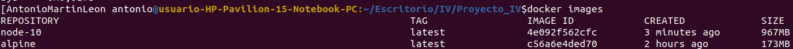
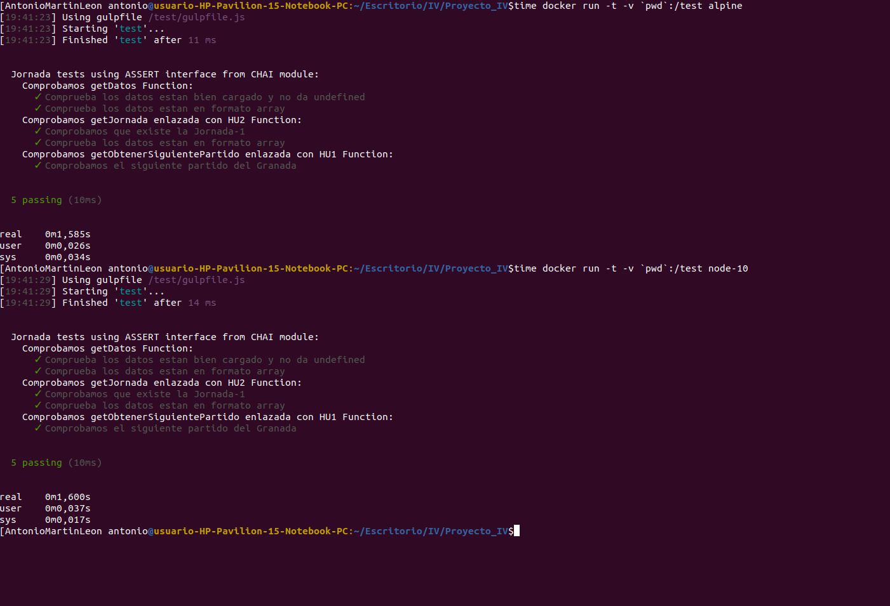

## Comparación de 2 imágenes
He optado por usar Alpine y Node:10.

Como podemos ver Alpine tarda 1.585s y pesa 173MB, en cambio, Node-10 tarda 0m1,6s y pesa 967MB . Por tanto, es mucho mejor Alpine.
