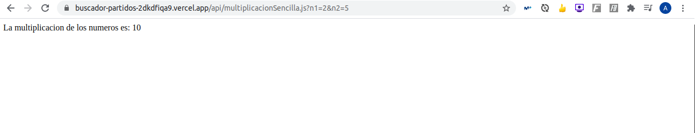

# Conexión entre el repositorio en GitHub y Vercel

## ¿Qué es Vercel?
Vercel consiste en una plataforma o aplicación que hace posible el despliegue de funciones serverless de manera simple, además permite enlazarlo con GitHUb entre otros sitios permitiendo el despliegue automático de nuestro proyecto.

## ¿Cómo conectar GitHub y Vercel?
- Lo primero que hay que hacer es registrase en la plataforma, te permite hacerlo con GitHub por tanto es muy rápido y sencillo.
- Lo siguiente que hay que hacer es importar el proyecto con el que queremos trabajar, para ello le damos a *Import Project*


- Introducimos la URL de nuestro proyecto


- En mi caso, me ha dado un error por lo que he tenido que darle permisos, ya que las pruebas que hice con Vercel no deje que accediera a todos mis repositorios, por tanto, le damos permisos para el repositorio del proyecto, en mi caso [BuscadorPartidos](https://github.com/antonioml97/BuscadorPartidos).
                                                                                                    


- Arreglado el problema anterior, ya no tenemos problemas para seguir importándolo


- Tenemos que instalar vercel cli, para implementar el proyecto, paro eso ejecutatmos: 
``` npm i -g vercel ```
- Tras esto ejecutamos ```vercel ``` donde nos preguntara si queremos vincularlo con uno ya existente que es el lp que vamos a hacer.

- Por último, para desplegar hacemos ```vercel --prod```


## Ejemplo simple
Para usar Vercel es necesario tener una carpeta denominada *api*. La primera función que he hecho es una sencilla multiplicación, realiza de esta manera:


                                                                    
- Pequeña explicación:
    - req: la petición, a través de la query string, donde reciberemos los valores para n1 y n2, por defecto tienen 0.0.
    - send: es una función en la que enviamos la respuesta.
    - res: e la forma de enviar la respuesta.

Una vez realizada la función vamos a despegarla, simplemente hacemos git push con  nuestra carpeta *api*.
Tras esto, vamos a la pagina de Vercel y seleccionamos *buscador-partidos.vercel.app*, le damos a *Visit*                                                            


Y cambiamos la URL añadiendo al final *multipliacionSencilla.js*, dando 0 al no haberle pasado ningún número.


Si cambiamos la URL añadiendo al final *multipliacionSencilla.js?n1=2&n2=5*, el resultado es 10 al haberle pasado n1=2 y n2=10.
.

Con este sencillo ejemplo se ve como se puede desplegar una función serverless fácilmente. 
