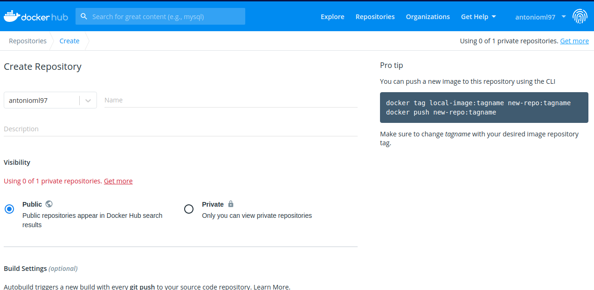
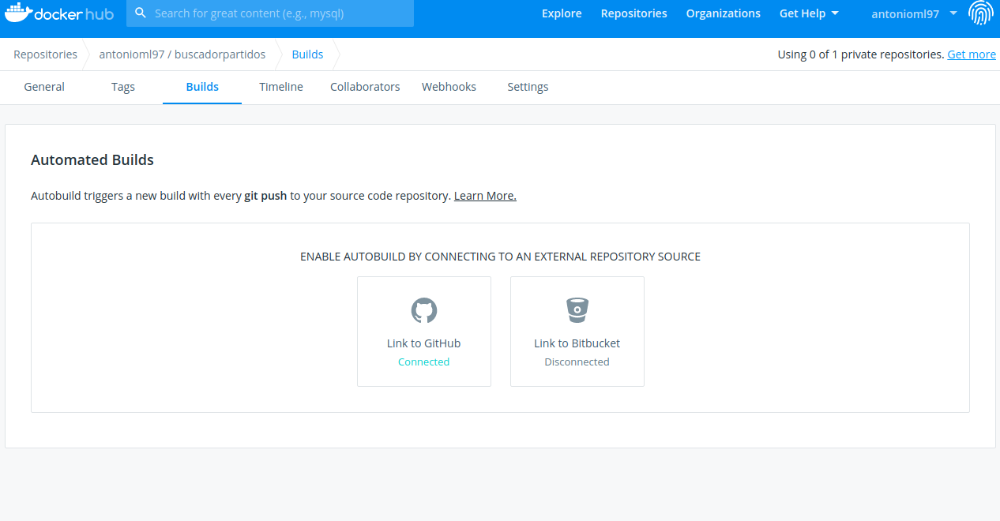
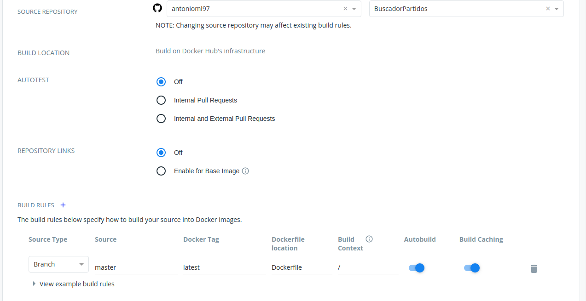
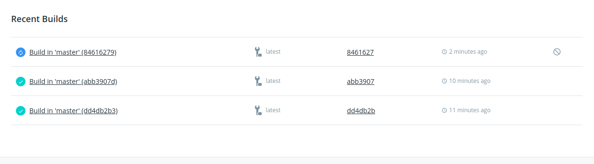

# DOCKER HUB
## ¿Qué es DockerHub?
Docker Hub el es un espacio de nube donde tenemos todo lo necesario para subir nuestras imágenes Docker y tenerlas siempre disponibles, podemos decir que es alma del proyecto, ya que es aquí donde nos reunimos para dar vida a nuestros proyectos.

## Primeros pasos
Como es lógico lo primero es crea una nueva cuenta y posteriormente crear nuestro repositorio, y conectarlo con GitHub para que se actualice de forma automática.

De esta manera, todos los cambios que se realicen en github verán aquí también sus cambios.
