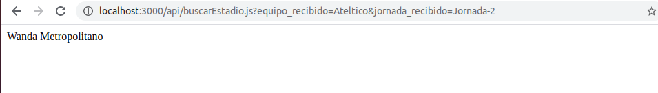

# Más allá del despliegue
Para no quedarme en un simple ejemplo, he creado la HU05 que permite al usuario saber en que estado se va jugar el siguiente partido de un equipo.

He usado los datos que ya teníamos en el fichero [datos.json](https://github.com/antonioml97/BuscadorPartidos/blob/master/datos/datos.json), con estos datos que se cargan automáticamente cuando creamos un objeto nuevo de la clase *Jornada* son los que vamos a usar para las consultas.

Lo siguiente que he hecho es crear la **funcion serverless**, para ello he credo el archivo buscarEstadio.js que proporciona al usuario donde jugara un equipo en una jornada indicada, estos paramentos se pasan por la URL. Una prueba de su uso:

